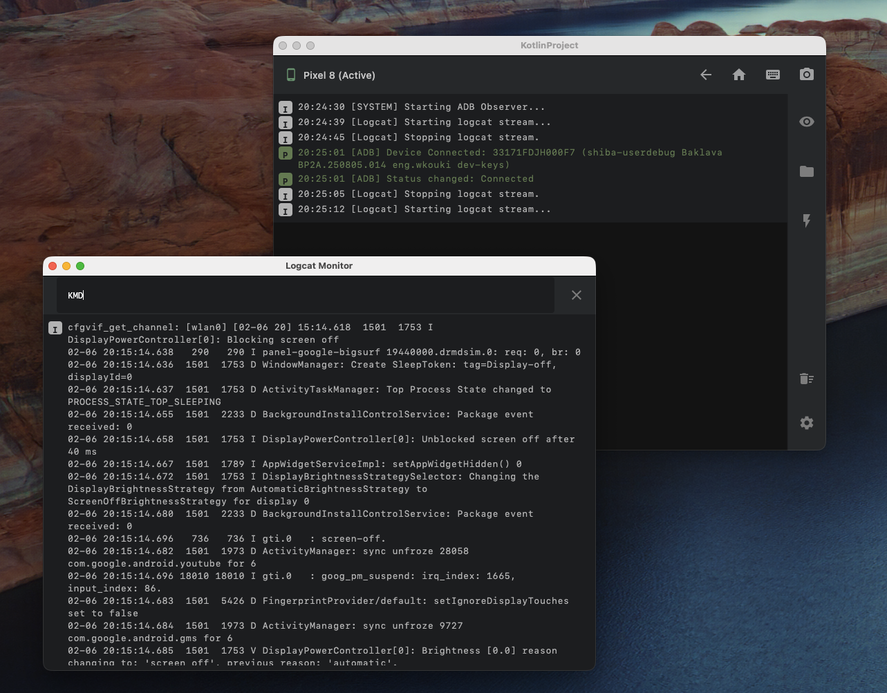

# TestBed Core

TestBed Core is a **Kotlin Multiplatform Desktop Application** designed for Android device management, automation, and testing. It provides a lightweight GUI for ADB/Fastboot operations and serves as a host for running custom test plugins.



## Key Features

* **Portable Design**: Runs immediately without complex installation. ADB and Fastboot are automatically set up within the tool's directory.
* **Device Control**: One-click actions for Reboot (System/Bootloader), Screenshots, Text Input, and App Data Clearing.
* **Logcat Monitor**: Real-time log monitoring with filtering and level selection.
* **Test Plugin Host**: Load and execute custom JUnit-based test plugins (JARs) dynamically.
* **Cross-Platform**: Works on Windows, macOS, and Linux.

## Prerequisites

* **Java Runtime Environment (JRE) 17** or higher must be installed.

## Getting Started

You do not need to install Android SDK or configure system PATHs manually. This tool handles the environment setup for you.

### 1. Build the Application
To generate the portable executable JAR (Fat JAR), run the following command in the project root:

**macOS / Linux:**
```bash
./gradlew :composeApp:packageUberJarForCurrentOS
```

**Windows:**
```cmd
gradlew.bat :composeApp:packageUberJarForCurrentOS
```

*The output JAR will be located at:* `composeApp/build/compose/jars/testbed-core-1.0.0.jar`

### 2. Run the Tool
We provide launcher scripts that automatically handle ADB setup and temporary PATH configuration.

**Windows:**
Double-click **`run_tool.bat`** in the project root.

**macOS / Linux:**
Run the shell script from the terminal:
```bash
./run_tool.sh
```
> **Note**: On the first run, the script will automatically check for `platform-tools` (ADB/Fastboot). If they are missing, it will download and set them up in the `bin/` directory.

---

## Development

This project is built with **Compose Multiplatform** and **Kotlin**.

### Project Structure
* **`composeApp`**: Main application source code (UI & Logic).
    * `commonMain`: Shared code (Business logic, ADB handling).
    * `jvmMain`: Desktop-specific implementations.
* **`scripts`**: Setup scripts for downloading platform-tools (`setup_tools.bat/sh`).
* **`plugins`**: Directory for placing external test plugin JARs.

### Running in IDE
To run the application in development mode with hot-reload support:

```bash
./gradlew :composeApp:run
```

## Troubleshooting

**"ADB not found" error:**
Ensure you are launching the app using `run_tool.bat` or `run_tool.sh`. These scripts add the bundled `bin/platform-tools` to the PATH temporarily.

**Wireshark / Packet Capture issues:**
Some test plugins may require Wireshark (`tshark`). Ensure it is installed and accessible if you plan to use network capture features.
* **Windows**: Install [Npcap](https://npcap.com/) and Wireshark.
* **Linux**: Ensure your user has permissions to capture packets (e.g., `wireshark` group).

## License

This project is licensed under the Apache License, Version 2.0.