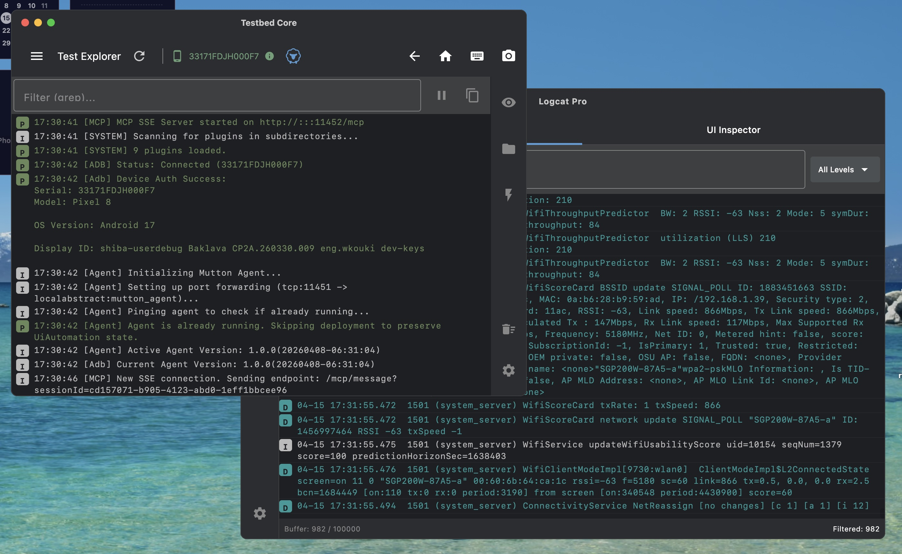

# TestBed Core

TestBed Core is a **Kotlin Multiplatform Desktop Application** designed for Android device management, automation, and testing. It provides a lightweight GUI for ADB/Fastboot operations and serves as a host for running custom test plugins.



## Key Features

* **Portable Design**: Runs immediately without complex installation. ADB and Fastboot are automatically set up within the tool's directory.
* **Standalone Execution**: No Java Runtime Environment (JRE) required for end-users. The application comes with a bundled lightweight JRE.
* **Device Control**: One-click actions for Reboot (System/Bootloader), Screenshots, Text Input, and App Data Clearing.
* **Logcat Monitor**: Real-time log monitoring with filtering and level selection.
* **Test Plugin Host**: Load and execute custom JUnit-based test plugins (JARs) dynamically.
* **MCP Server**: Built-in Model Context Protocol (SSE) server for LLM agent integration, enabling remote device control and automated test execution.
* **Cross-Platform**: Works on Windows, macOS, and Linux.

## Getting Started (For End Users)

You do not need to install Android Studio, Android SDK, or even Java. The provided launcher scripts handle the environment setup automatically.

### 1. Download
Download the latest release ZIP file for your operating system (Windows, macOS, or Ubuntu) from the Releases or GitHub Actions Artifacts page and extract it.

### 2. Run the Tool
Navigate to the extracted folder and execute the launcher script for your OS:

* **Windows**: Double-click `testbed-windows.bat`.
* **Linux (Ubuntu)**: Open a terminal and run `./testbed-ubuntu.sh` (make sure it has execute permissions: `chmod +x testbed-ubuntu.sh`).
  * **Note for HiDPI/4K displays**: If the font or UI elements appear extremely small, you can scale them by prefixing the command with `GDK_SCALE`. For example: `GDK_SCALE=2 ./testbed-ubuntu.sh`.
* **macOS**: Double-click the `TestbedCore.app` icon. *(If you see an "unidentified developer" warning, right-click the app, select **Open**, and click **Open** again).*

> **Note**: On the first run, the script will automatically download the official Android SDK `platform-tools` (ADB/Fastboot) from Google and set them up in the `bin/` directory.

---

## Test Plugins & Reports

TestBed Core supports running custom test plugins and generating detailed reports.

### Importing Plugins & Resources
You can import test plugins and their required resources using the **Import ZIP** button in the Test Explorer.
* The ZIP file for import is typically provided as an attachment in the project releases.
* This ZIP file is generated by the `testbedui-plugins` repository and contains compiled plugin JARs and auxiliary resources (e.g., certificates, configuration files).

### Test Reports
After executing a test, the tool automatically generates reports in the `results` directory:
* **JUnit XML Report**: The base evidence file containing test results and captured output.
* **HTML Report**: A human-readable summary generated from the XML report using XSLT (`summary.xslt`). Both files are preserved for auditing purposes.

---

## Development & Building from Source

This project is built with **Compose Multiplatform** and **Kotlin**.

### Prerequisites for Development
* **Java Development Kit (JDK) 21** or higher.

### Project Structure
* **`composeApp`**: Main application source code (UI & Logic).
* **`scripts`**: Setup scripts for downloading platform-tools (`setup_tools.bat/sh`).
* **`pkg-items`**: Launcher scripts and OS-specific README files for distribution packages.
* **`plugins`**: Directory for placing external test plugin JARs.

### Building Native Distributions
To generate standalone executable packages (with bundled JRE), run the following command. The output will be located in `composeApp/build/compose/binaries/`.

**macOS / Linux:**
```bash
./gradlew :composeApp:createReleaseDistributable
```
**Windows:**
```cmd
gradlew.bat :composeApp:createReleaseDistributable
```

*(Note: GitHub Actions has separate workflows under `.github/workflows/` for `build` -> `repackage-zip` -> `release`.)*

### Running in IDE
To run the application in development mode with hot-reload support:

```bash
./gradlew :composeApp:run
```

## Troubleshooting

**"ADB not found" error:**
Ensure you are launching the app using the provided scripts (e.g., `testbed-windows.bat`). These scripts add the bundled `bin/platform-tools` to the `PATH` temporarily.

## LLM Agent Integration (Model Context Protocol)

TestBed Core exposes its device control and test execution APIs as a Model Context Protocol (MCP) server. 

### Stdio-to-SSE Bridge (Recommended for LLM Clients)

While TestBed Core runs an SSE (Server-Sent Events) network server at `http://localhost:11452/mcp` on port 11452, direct HTTP/SSE connections from LLM agents (like Antigravity) can sometimes suffer from network socket hangs or polling delays.

To resolve this, we provide a **Stdio-to-SSE Bridge** script: `scripts/mcp_stdio_bridge.py` (which is bundled inside the released packages under the `scripts/` directory). This script starts a stable, local Stdio channel for the LLM agent and proxies all JSON-RPC requests to the background Ktor SSE server.

#### How to configure in Antigravity / Cline

Add the following to your `mcp_config.json` configuration file:

```json
{
  "mcpServers": {
    "testbed-core": {
      "command": "python3",
      "args": ["/path/to/testbed-core/scripts/mcp_stdio_bridge.py"]
    }
  }
}
```

This ensures maximum stability using Antigravity's native Stdio process channel.

## License

This project is licensed under the Apache License, Version 2.0.
