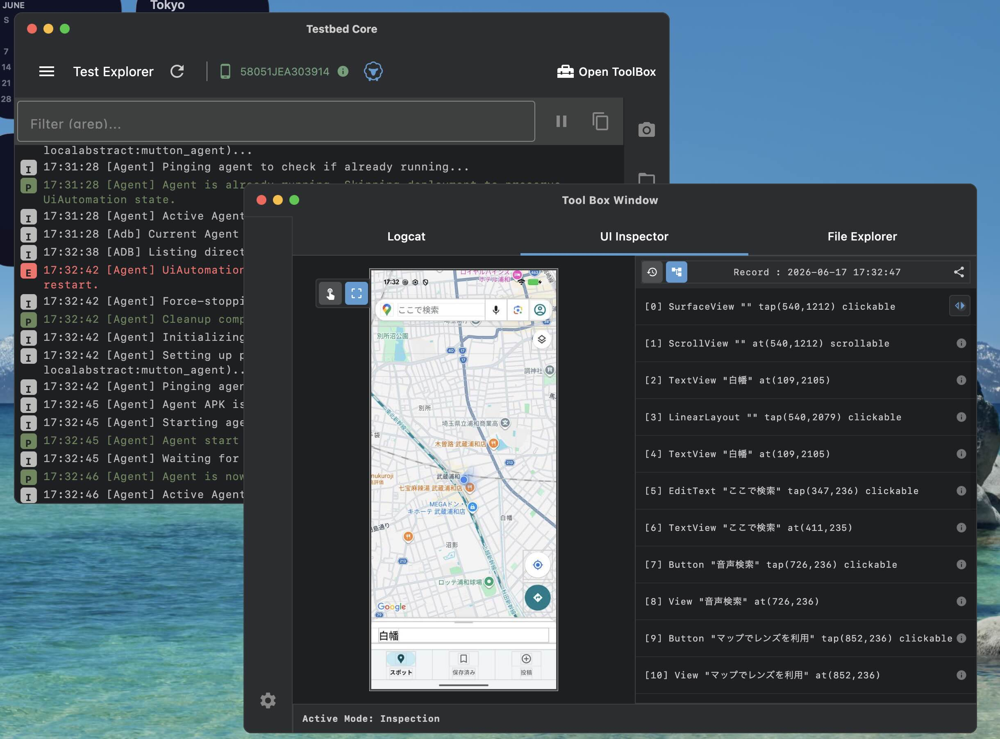

# TestBed Core 

[🇺🇸 EN](./README.md) | 🇯🇵 JP

TestBed Core は、Android デバイス管理、自動化、およびテスト用に設計された **Compose Multiplatform デスクトップ アプリケーション** です。ADB デバイス操作のための軽量な GUI、動的なテスト プラグイン ホスティング、および LLM エージェントを統合するための組み込み Model Context Protocol (MCP) サーバーを提供します。



## 主な機能

* **ポータブル設計**: 複雑なインストールなしで、すぐに実行できます。ADB はツールのディレクトリ内に自動的にセットアップされます。
* **スタンドアロン実行**: エンドユーザーが Java Runtime Environment (JRE) をインストールする必要はありません。アプリケーションには、軽量な JRE が同梱されています。
* **Logcat モニター**: フィルタリング、タグ マッチング、ログレベルの選択によるリアルタイムのログ監視が可能です。
* **ファイル エクスプローラー**: ホストからデバイスへのファイルのプッシュ/プル、ファイル プレビューが可能な動的なファイル システム エクスプローラーです。
* **UI インスペクター & レイアウト アーカイバー**: クリック座標シミュレーション、および自動でのレイアウト保存機能を備えたインタラクティブな UI ツリー ビューワーです。保存されたレイアウトは SQLite データベースにカタログ化され、UUID やカスタム タグを使用して過去のレイアウト履歴を MCP から逆引き取得できます。
* **テスト プラグイン ホスト**: カスタム JUnit ベースのテスト プラグイン (JAR) を動的にロード・実行し、リアルタイムでアサーションやログを確認できます。
* **MCP サーバー**: LLM エージェント (Antigravity など) 統合のための Model Context Protocol (SSE) サーバーを内蔵しており、リモートからのデバイス制御、テストの自動実行、レイアウト履歴クエリを可能にします。
* **クロスプラットフォーム**: Windows、macOS、Linux で動作します。

---

## はじめに (エンドユーザー向け)

Android Studio、Android SDK、または Java を個別にインストールする必要はありません。提供されている起動スクリプトが環境設定を自動的に処理します。

### 1. ダウンロード
Releases ページから、使用しているオペレーティング システム (Windows、macOS、または Ubuntu) に適した最新のリリース ZIP ファイルをダウンロードし、展開します。

### 2. 実行
展開したフォルダに移動し、OS に対応するランチャー スクリプトを実行します。

* **Windows**: `testbed-windows.bat` をダブルクリックします。
* **Linux (Ubuntu)**: ターミナルを開き、`./testbed-ubuntu.sh` を実行します (実行権限があることを確認してください: `chmod +x testbed-ubuntu.sh`)。
  * **高解像度 (HiDPI/4K) ディスプレイに関する注意**: フォントやUI要素が非常に小さく表示される場合は、コマンドの先頭に `GDK_SCALE` を付与してスケールを変更できます (例: `GDK_SCALE=2 ./testbed-ubuntu.sh`)。
* **macOS**: `TestbedCore.app` アイコンをダブルクリックします。*(「開発元が未確認」という警告が表示された場合は、アプリを右クリックして「開く」を選択し、ダイアログで再度「開く」をクリックします)。*

> **注意**: 初回起動時に、スクリプトは Google から公式の Android SDK `platform-tools` (ADB) を自動的にダウンロードし、`bin/` ディレクトリにセットアップします。

---

## テストプラグイン & レポート

TestBed Core は、カスタム テスト プラグインの実行と、詳細なレポートの生成をサポートしています。

### プラグインとリソースのインポート
Test Explorer の **Import ZIP** ボタンを使用して、テスト プラグインと必要なリソースをインポートできます。
* インポート用 ZIP ファイルは、通常プロジェクトのリリースの添付ファイルとして提供されます。
* この ZIP ファイルは `testbedui-plugins` リポジトリによって生成され、コンパイル済みのプラグイン JAR と補助的なリソース (証明書、構成ファイルなど) が含まれています。

### テストレポート
テスト実行後、ツールは自動的に `results` ディレクトリにレポートを生成します。
* **JUnit XML レポート**: テスト結果とキャプチャされた出力を含む基本証跡ファイル。
* **HTML レポート**: XSLT (`summary.xslt`) を使用して XML レポートから生成された、監査用の人間が読めるサマリー。監査目的で両方のファイルが保存されます。

---

## ソースからのビルドと開発

このプロジェクトは **Compose Multiplatform** と **Kotlin** で構築されています。

### 開発の前提条件
* **Java Development Kit (JDK) 21** 以上。

### プロジェクト構造
* **`composeApp`**: メインアプリケーションのソースコード (UI & ロジック)。
* **`scripts`**: プラットフォームツールのダウンロードセットアップスクリプト (`setup_tools.bat/sh`)。
* **`pkg-items`**: 配布パッケージ用のランチャースクリプトとOS固有のREADMEファイル。
* **`plugins`**: 外部テストプラグイン JAR を配置するディレクトリ。

### ネイティブディストリビューションのビルド
JRE を同梱したスタンドアロンの実行可能パッケージを生成するには、以下のコマンドを実行します。出力は `composeApp/build/compose/binaries/` に配置されます。

**macOS / Linux:**
```bash
./gradlew :composeApp:createReleaseDistributable
```
**Windows:**
```cmd
gradlew.bat :composeApp:createReleaseDistributable
```

### IDEでの実行
ホットリロードを有効にして開発モードでアプリケーションを実行するには:

```bash
./gradlew :composeApp:run
```

---

## トラブルシューティング

**「ADB が見つかりません」エラー:**
必ず提供されているスクリプト (例: `testbed-windows.bat`) を使用してアプリを起動してください。これらのスクリプトは、同梱の `bin/platform-tools` を一時的に `PATH` に追加します。

---

## LLM エージェント統合 (Model Context Protocol)

TestBed Core は、デバイス制御およびテスト実行 API を Model Context Protocol (MCP) サーバーとして公開しています。

### Stdio-to-SSE ブリッジ (推奨)

TestBed Core はポート 11452 の `http://localhost:11452/mcp` で SSE (Server-Sent Events) サーバーを動作させますが、LLM エージェント (Antigravity など) からの直接の HTTP/SSE 接続は、ネットワークの瞬断やポーリング遅延の影響を受ける場合があります。

安定性を最大化するため、ローカルの stdio チャンネルを中継する **Stdio-to-SSE ブリッジ** スクリプト `scripts/mcp_stdio_bridge.py` を提供しています。

#### Antigravity / Cline での設定例

`mcp_config.json` に以下の設定を追加してください：

```json
{
  "mcpServers": {
    "testbed-core": {
      "command": "python3",
      "args": ["/path/to/testbed-core/scripts/mcp_stdio_bridge.py"]
    }
  }
}
```

これにより、エージェント側で Stdio プロセスチャネルを使用した最も安定した連携が保証されます。

---

## ライセンス

このプロジェクトは、Apache License, Version 2.0 に基づいてライセンスされています。
