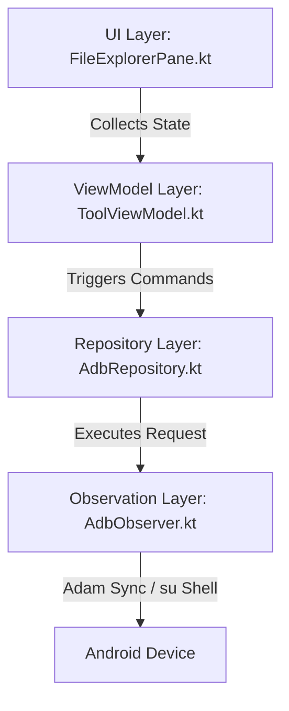

# Implementation Plan: Android Device File Explorer Integration

## 1. Overview & Objectives
This plan outlines the implementation of a **File Explorer** feature inside the `testbed-core` host application. 
The tool allows browsing the entire Android device file system (starting from the root `/`), previewing file content (text preview or stylized Hex Dump for all binaries), and performing robust `pull` and `push` operations. 

To handle system-protected folders (such as `/data/data`), the tool intelligently utilizes **Root (su) access** via automated temporary transfers.
The File Explorer is integrated as a **third tab** alongside "Logcat" and "UI Inspector" in the main `ToolWindow`.

---

## 2. Architectural Overview

The feature consists of three primary layers:


### A. UI Layer (`FileExplorerPane.kt`)
- A Compose-based split pane showing:
  - **Left/Top**: Breadcrumbs & Path Bar, Toolbar (Refresh, Push, Pull, Up-one-level, Root Mode Indicator), and the File List Table (Icon, Name, Size, Modified Date).
  - **Right/Bottom**: Preview Pane. Displays the file's start content as plain text or a clean Hex-Editor-style dump.
- Fully responsive and dynamic, fitting seamlessly into the existing Sleek Dark theme (`Color(0xFF1E1F22)`).

### B. State & ViewModel Layer (`ToolViewModel.kt`)
- Exposes StateFlows for:
  - `currentPath`: `MutableStateFlow<String>` (Default: `"/"`)
  - `fileList`: `MutableStateFlow<List<AdbFile>>`
  - `selectedFile`: `MutableStateFlow<AdbFile?>`
  - `previewContent`: `MutableStateFlow<PreviewData?>`
  - `isTransferring`: `MutableStateFlow<Boolean>` (for progress states)
  - `isRootMode`: `MutableStateFlow<Boolean>` (whether `su` wrapper is used for directories)
- Coordinates asynchronous KMP coroutines for non-blocking IO operations on `Dispatchers.IO`.

### C. Repository & Observation Layer (`AdbObserver.kt` / `AdbRepository.kt`)
- Interfaces with **Adam** using:
  - `ShellCommandRequest` to query directories (`ls -l` or `su -c "ls -l"`) and query preview headers (`head -c`).
  - `PullFileRequest` & `PushFileRequest` for robust file transfers (augmented with root-arbitrated transfers for protected paths).

---

## 3. Detailed Feature Specifications

### A. File Browsing & Listing with Root Access
- **Default Path**: Starts at `/`.
- **Directory Listing**:
  - If the user enters a directory or standard listing fails due to permissions, the app fallback-queries using `su -c "ls -al <path>"`.
  - Runs a shell `ls -al` command and parses the stdout line by line into:
    ```kotlin
    data class AdbFile(
        val name: String,
        val isDirectory: Boolean,
        val size: Long,
        val permissions: String,
        val lastModified: String,
        val isSymbolicLink: Boolean,
        val linkTarget: String? = null
    )
    ```

### B. Root-Arbitrated Pull & Push Mechanism (Landing Transfer Strategy)
Since Adam's `PullFileRequest` and `PushFileRequest` run under the default `shell` user permission boundary, they cannot directly touch files in protected directories like `/data/data`. We solve this with an elegant **Landing Transfer Strategy**:

#### 1. Pull File (Protected Remote -> Local PC)
1. Execute: `su -c "cp <remotePath> /data/local/tmp/temp_pull && chmod 666 /data/local/tmp/temp_pull"` on the device.
2. Transfer `/data/local/tmp/temp_pull` to the host PC using Adam's standard `PullFileRequest` (utilizing native AWT `FileDialog` for destination choice).
3. Execute: `rm /data/local/tmp/temp_pull` to clean up.

#### 2. Push File (Local PC -> Protected Remote)
1. Push the file from PC to `/data/local/tmp/temp_push` using Adam's standard `PushFileRequest`.
2. Execute: `su -c "mv /data/local/tmp/temp_push <remotePath> && chmod 600 <remotePath>"` to move the file to its destination and restore security.
3. Execute: `rm -f /data/local/tmp/temp_push` as a fallback cleanup.

### C. Preview Capability (Text & Hex Dump)
To ensure light execution, all previews are loaded on-demand for the **first 2KB of data**:
- **Text Classification**: If the file is recognized as common text (e.g., `.txt`, `.xml`, `.json`, `.log`, `.prop`, `.sh`, `.conf`), it reads the content as UTF-8.
  - Command: `su -c "head -c 2048 '<path>'"` (wrapped with `su` if in root mode).
- **Binary & Others**: Automatically rendered in a clean Hex Dump layout:
  ```
  00000000  89 50 4e 47 0d 0a 1a 0a  00 00 00 0d 49 48 44 52  |.PNG........IHDR|
  00000010  00 00 04 38 00 00 09 60  08 06 00 00 00 e5 7b a4  |...8...`......{|
  ```

---

## 4. Implementation Phases

### Phase 1: Backend Foundations (`AdbObserver.kt` & `AdbRepository.kt`)
- Define `AdbFile` model class.
- Implement `listDirectory(path: String, useRoot: Boolean): List<AdbFile>`.
- Implement `getFilePreview(path: String, useRoot: Boolean): PreviewData`.
- Implement Root-Arbitrated Pull and Push functions.

### Phase 2: View State & Business Logic (`ToolViewModel.kt`)
- Add tab state for File Explorer.
- Implement state tracking and directory navigation history.
- Write non-blocking coroutine integrations for the file API.

### Phase 3: Premium UI Design (`FileExplorerPane.kt` & `ToolWindow.kt`)
- Design the file browser split pane using custom dark styling.
- Implement mono-spaced typography for hex-dump and text viewers.
- Add dynamic AWT Native File Dialogs for PC file picking.
