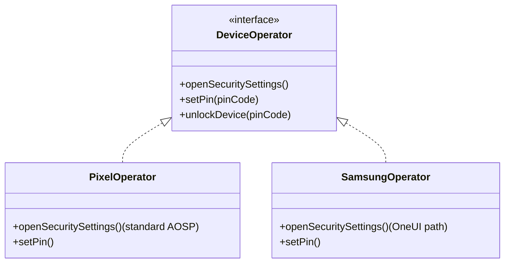

# Page Object Model (POM) Strategy for Vendor Customization

This document outlines the architectural strategy for managing vendor-specific UI variances (such as settings layouts on Samsung, Xiaomi, Sony, Sharp, etc.) within the TestBed Core automation framework.

---

## 1. The Challenge of Vendor UI Fragmentation
In Android device evaluation (specifically for CC/MDFPP conformance validation), standard APIs or settings panels can be heavily customized by individual OEM vendors. For example:
- Pixel (Google / AOSP) lists lock screen configurations under `Settings -> Security`.
- Samsung Galaxy (OneUI) groups biological security configurations under `Biometrics and Security`.
- Intent actions like `ACTION_SECURITY_SETTINGS` might trigger different target layouts across Xiaomi, Sharp, or Sony devices.

Directly hardcoding UI interactions (e.g. click coordinates or specific element text) inside test suites will lead to massive test failures when running the same suite on multiple vendor targets.

---

## 2. Decoupling Logic from Interactions (POM)
To resolve fragmentation, TestBed Core plugins should abstract all UI actions behind interfaces, separating **What** is being tested from **How** the action is performed.



### Reference Interface (`DeviceOperator.kt`)
```kotlin
interface DeviceOperator {
    fun openSecuritySettings()
    fun setPin(pin: String)
    fun unlockDevice(pin: String)
}
```

- **Pixel/Reference Operator (`PixelOperator.kt`):** Implements standard AOSP selector paths. This serves as the baseline implementation.
- **Samsung Operator (`SamsungOperator.kt`):** Overrides security configurations to handle Samsung OneUI Specific menus.

The test suite executes against the `DeviceOperator` interface, and the correct operator profile is loaded dynamically at runtime depending on the target device's manufacturer properties.

---

## 3. LLM-Assisted Automated UI Path Discovery

The MCP server architecture provides a powerful way to automate the implementation of these vendor-specific classes. Instead of human QA engineers manually exploring settings menus on every new firmware version, an LLM agent (like Gemini) can dynamically construct the implementation:

1. **System Property Check:** The agent executes `get_device_info` to identify the manufacturer (e.g., Xiaomi).
2. **Settings Exploration:** The agent issues `open_settings(panel="SECURITY")`, inspects the resulting layout via `get_ui_dump`, and follows the menu structure by triggering `tap`, `swipe`, and `press_key` dynamically until it maps out the path to the PIN settings menu.
3. **Class Autogeneration:** Once the correct selectors and action paths are discovered, the agent writes the new Kotlin class (`XiaomiOperator.kt`) containing the custom selectors, saving it in the appropriate vendor module.
