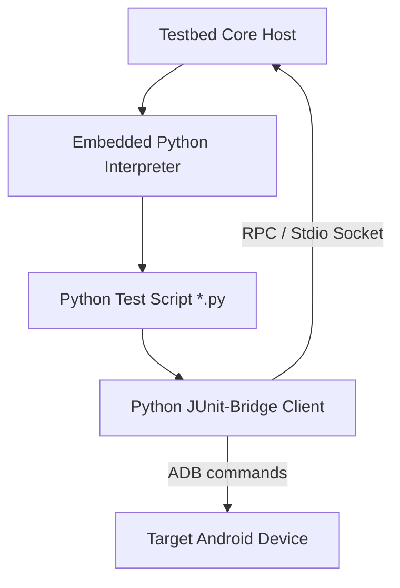

# Roadmap: Python-Based Test Scripting & Windows Portability Strategy

This roadmap details the architectural strategy for enabling Python-based test definitions and achieving complete dependency-free execution on Windows host environments by bundling an embeddable Python interpreter.

---

## 1. Vision: Python-Based Test Development (No-IDE Framework)

Currently, TestBed Core test suites must be written in Kotlin/Java, compiled into JAR packages, and imported as plugins. By introducing Python test definitions, we can eliminate the compilation step entirely.

### Key Benefits
* **Zero Compilation Overhead:** Test cases are read and executed dynamically as plain text scripts, removing the need for Gradle or Kotlin compiler setups.
* **LLM-Friendly Authoring:** Large Language Models (like Antigravity) excel at writing, editing, and debugging Python code. An agent can autonomously write and run a test case in response to natural language definitions without requiring a full IDE environment.
* **Rapid Prototyping:** Developers can modify test assertions and immediately execute them without a hot-reload or repackaging loop.

### Conceptual Architecture

---

## 2. Windows Portability: Eliminating Shell (`.sh`) Dependencies

Many network-related test suites currently rely on host-side shell scripts (`.sh` files) to perform cryptographic setups (e.g., executing `openssl` for mock certificate generation) and spawn background mock servers. This creates severe compatibility hurdles on Windows machines that lack a Unix-like shell environment.

### Solution: Bundling `embeddable-python`
We can configure the Windows distribution of TestBed Core to include the official **Windows embeddable package (Python zip package)**.
* **Portable Execution:** TestBed Core can execute Python code internally without requiring the user to install Python system-wide.
* **Replacing Bash Scripts:** All legacy `.sh` setup scripts and Python mocking scripts (such as `ocsp_stapling_server.py`) can be unified under Python scripts and executed natively via the embedded interpreter on both Windows, macOS, and Linux.

---

## 3. Implementation Steps

### Phase 1: RPC Bridge Design
* **Use Built-in `unittest` Framework:** Python's standard library includes the `unittest` module, which is modeled after JUnit (featuring `setUp()`, `tearDown()`, and `TestCase` classes). By aligning with `unittest` rather than third-party frameworks like `pytest`, we eliminate external dependencies (no `pip install` required), ensuring it runs instantly even on minimalist `embeddable-python` environments.
* Implement a lightweight RPC (Remote Procedure Call) interface or socket-based Stdio bridge between the Kotlin/JVM host application and the spawned Python process.
* Map critical `JUnitBridge` APIs (logging, path resolution, test status callbacks) to a helper Python library (`testbed_bridge`).

### Phase 2: Embedded Python Integration in Distribution
* Modify the GitHub Actions distribution workflows to download and bundle the `embeddable-python` zip into the `TestbedCore-windows.zip` bundle.
* Update path resolution in the host application to fall back to the bundled Python binary when launching scripts.

### Phase 3: Agent Automation Loop
* Expose tool handles to the MCP server that allow LLMs to write and execute python test files directly onto the device-under-test.
