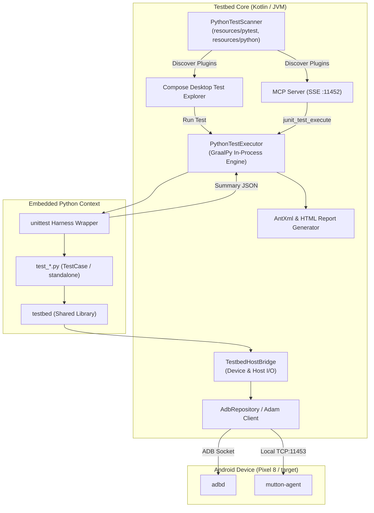

# TestBed Core: Python テストフレームワーク仕様書 & 移行設計

## 1. 現状のアーキテクチャと到達点 (Current State)

TestBed Core では、JUnit (Kotlin/Java) でコンパイル・パッケージ化（JAR）が必要だったテストスイートに加え、**組み込み Python (GraalPy 25.0.2 / Python 3.12 互換)** によるスクリプト直接実行環境を実装しました。



### 実装済みの機能
1. **完全透過なスクリプト実行 (No Python Installation Required)**:
   - ホスト環境への Python インストールや `pip` 不要。JVM プロセス内で GraalPy が高速動作。
   - macOS / Linux / Windows で同一挙動を保証。
2. **自動検出 & Test Explorer / MCP 統合**:
   - `resources/pytest/`, `resources/python/`, `plugins/` 配下の `test_*.py` を自動スキャン。
   - メタデータ (`CATEGORY`, `TITLE`, `DESCRIPTION`) の抽出。
   - GUI（`[PY]` バッジ表示、全件/単一メソッド実行）および MCP (`junit_test_list`, `junit_test_execute`, `junit_test_receive`) の完全対応。
3. **Java/AntXml と完全同一の監査レポート生成**:
   - 接続デバイス情報（シリアル、モデル、OS バージョン、ビルド番号）を `<properties>` に自動記録。
   - `<system-out>` / `<system-err>` への実行ログ・バナー出力の CDATA 埋め込み。
   - `summary.xslt` を用いた HTML レポートの自動生成と XML パッチマージ (`XmlMerger`)。
4. **実機接続テストの疎通確認済み**:
   - 実機（Pixel 8, Android 15）上で MDFPP 整合性テスト（FBE 暗号化状態、SELinux Enforcing、OS/パッチ整合性、時刻同期、フレームワーク確認）の自動パスを確認。

---

## 2. 既存テストの移植に必要な機能要件

現在 Java プラグインやシェルスクリプト (`.sh`) で行われている MDFPP / CC 検証処理を Python に移植するにあたり、以下の機能が必要となります。

| カテゴリ | 必要な機能・操作 | 現状の Java / Shell での実装例 |
| :--- | :--- | :--- |
| **Logcat 観測** | ・Logcat バッファのクリア<br>・特定タグ/文字列/正規表現のリアルタイム待機<br>・特定期間のログスライス抽出・保存 | `AdbObserver.getFilteredLogcat()`, `logcat -c`, `grep` |
| **端末ライフサイクル** | ・端末の再起動 (`adb reboot`)<br>・ブート完了待機 (`waitBoot` / `sys.boot_completed=1`)<br>・画面点灯 / キー送信 (`input keyevent POWER`) | `AdbDeviceRule.waitBoot()`, `AdbObserver.pressKey()` |
| **UI 自動化** | ・UI 階層ダンプ (JSON)<br>・画面上の座標タップ / スワイプ<br>・テキスト入力 (`inputText`)<br>・テキスト要素の検索とクリック | `AdbObserver.dumpMuttonAgent()`, `tapCoordinate()`, `mutton-agent` |
| **ファイル & ストレージ** | ・端末へのファイル push / pull<br>・パーミッション変更 (`chmod`), アプリデータ消去 (`pm clear`) | `adb push`, `executeAdbShell("pm clear ...")` |
| **ネットワーク & モック** | ・ポートフォワード / リバース設定 (`adb reverse tcp:X tcp:X`)<br>・モック TLS / OCSP / CRL サーバーの起動・停止<br>・パケットキャプチャ (`tcpdump`) の開始・停止 | `flash_poc_stallion.sh`, Python モックサーバー, `AdbObserver` |
| **暗号 & 証明書** | ・X.509 テスト証明書の生成 (KeyUsage, AIA OCSP URI 指定)<br>・ハッシュ計算 / 暗号アルゴリズム検証 | `openssl req/ca`, `hashlib`, `cryptography` |

---

## 3. 設計方針: Bridge vs 共有ライブラリ (ハイブリッド構成)

### 比較とトレードオフ

```
┌─────────────────────────────────────────────────────────────┐
│ 方式 A: Bridge 集中型 (Kotlin Host 側に API を追加)         │
│   メリット: Adam や AdbObserver の非同期ソケット処理を直結でき、 │
│             タイムアウト管理やハング防止が確実。            │
│   デメリット: 新しい操作を追加するたびに Kotlin の再ビルドが必要。│
├─────────────────────────────────────────────────────────────┤
│ 方式 B: Python 共有ライブラリ型 (純 Python で実装)           │
│   メリット: Python コードのみで機能追加・修正が完結。        │
│   デメリット: adb コマンドの多重呼出でオーバーヘッド大。    │
│               Logcat ストリーミングなど長時間の監視でハングリスク。│
└─────────────────────────────────────────────────────────────┘
```

### 推奨アーキテクチャ: 【ハイブリッド構成】

**「重い I/O・非同期ソケット通信・排他制御は Kotlin Bridge に持たせ、Python 側には直感的なラッパー（コンテキストマネージャ等）の共有ライブラリを提供する」** 設計を採用します。

```
┌──────────────────────────────────────────────────────────────┐
│  Python Test Script (test_*.py)                              │
│  e.g. with logcat.watch(tag="KeyStore", pattern=".*ready.*"): │
│            device.reboot_and_wait()                          │
└──────────────────────────────┬───────────────────────────────┘
                               │ (Pythonic API)
┌──────────────────────────────▼───────────────────────────────┐
│  Shared Python Package: `testbed` (resources/pytest/testbed/) │
│  - testbed.device  (DeviceController)                        │
│  - testbed.logcat  (LogcatWatcher / ContextManager)          │
│  - testbed.ui      (UiAutomator / MuttonAgentClient)         │
│  - testbed.network (ReversePort / MockServer)                │
└──────────────────────────────┬───────────────────────────────┘
                               │ (Direct Host Interop)
┌──────────────────────────────▼───────────────────────────────┐
│  TestbedHostBridge (Kotlin / PythonTestExecutor)             │
│  - executeShell(cmd), getProp(key)                           │
│  - waitForLogcat(regex, timeoutMs, tags)                     │
│  - waitBoot(timeoutMs), reboot()                             │
│  - reversePort(remote, local), removeReversePort(remote)     │
│  - dumpUi(), tap(x, y), swipe(...)                           │
└──────────────────────────────────────────────────────────────┘
```

---

## 4. 詳細 API 仕様設計

### 1. `TestbedHostBridge` (Kotlin Host 側に追加する API)

```kotlin
class TestbedHostBridge {
    // --- デバイス情報 & 基本操作 ---
    fun getDeviceSerial(): String
    fun getDeviceModel(): String
    fun getOsVersion(): String
    fun isDeviceConnected(): Boolean
    fun executeShell(command: String): String
    fun getProp(key: String): String

    // --- Logcat 監視 & キャプチャ ---
    fun clearLogcat(): Boolean
    fun waitForLogcat(regex: String, timeoutMs: Long = 10000, tags: List<String> = emptyList()): String?
    fun getLogcatSlice(pastSeconds: Int = 30, tags: List<String> = emptyList()): String

    // --- 端末制御 & ライフサイクル ---
    fun reboot(mode: String = ""): Boolean
    fun waitBoot(timeoutMs: Long = 90000): Boolean
    fun pressKey(keyCode: String): Boolean
    fun inputText(text: String): Boolean

    // --- Mutton Agent / UI 自動化 ---
    fun tap(x: Int, y: Int): Boolean
    fun swipe(x1: Int, y1: Int, x2: Int, y2: Int): Boolean
    fun dumpUi(includeImage: Boolean = false): String  // Returns Layout JSON

    // --- ポート制御 & ファイル転送 ---
    fun reversePort(devicePort: Int, hostPort: Int): Boolean
    fun removeReversePort(devicePort: Int): Boolean
    fun pushFile(localPath: String, remotePath: String): Boolean
    fun pullFile(remotePath: String, localPath: String): Boolean

    // --- ログ & 進捗 & レポート ---
    fun log(tag: String, message: String, level: String = "INFO")
    fun setProgress(step: String, percent: Int)
    fun getResourcePath(relPath: String): String
    fun getResultsPath(): String
    fun submitReport(summaryJson: String)
}
```

### 2. Python 共有ライブラリ (`resources/pytest/testbed/`)

Python テスト開発者が簡潔かつ宣言的に記述できるようにするラッパーモジュール群です。

#### (1) Logcat 監視 (`testbed.logcat`)
```python
from testbed import logcat

class MySecurityTest(unittest.TestCase):
    def test_keystore_generation(self):
        # コンテキストマネージャでログを監視しながら処理を実行
        with logcat.watch(tag="AndroidKeyStore", pattern=r"Key \w+ generated successfully", timeout=15) as watcher:
            self.trigger_key_generation()
            match = watcher.wait()
            self.assertIsNotNone(match, "KeyStore log event was not observed")
```

#### (2) デバイス制御 (`testbed.device`)
```python
from testbed import device

class MyRebootTest(unittest.TestCase):
    def test_fbe_after_reboot(self):
        device.reboot_and_wait(timeout=90)
        self.assertEqual(device.get_prop("ro.crypto.state"), "encrypted")
```

#### (3) UI 操作 (`testbed.ui`)
```python
from testbed import ui

class MySettingsTest(unittest.TestCase):
    def test_open_security_settings(self):
        ui.open_settings("security")
        ui.wait_and_click_text("Encryption & credentials")
        self.assertTrue(ui.has_text("Storage encryption"))
```

#### (4) ネットワーク & モック (`testbed.network`)
```python
from testbed import network

class MyTlsTest(unittest.TestCase):
    def test_ocsp_stapling(self):
        with network.reverse_port(device_port=8888, host_port=8888):
            with network.start_mock_ocsp_server(port=8888, status="good"):
                # デバイス側から通信をトリガー
                result = self.trigger_tls_connection()
                self.assertTrue(result.handshake_success)
```

---

## 5. 移行ロードマップ (Migration Plan)

| フェーズ | 実施内容 | 対象ファイル / 成果物 |
| :--- | :--- | :--- |
| **Phase 1<br>(基盤完了)** | ・GraalPy 組み込み実行エンジンの実装<br>・JUnit XML / HTML レポート体裁の統一<br>・基本 Bridge (`executeShell`, `getProp`) と実機疎通確認 | `PythonRunner.kt`<br>`PythonTestExecutor.kt`<br>`test_device_mdfpp_verification.py` |
| **Phase 2<br>(Bridge 拡張 & 共有ライブラリ)** | ・Bridge への Logcat 監視・端末再起動・ポートリバース・UI 操作 API 追加<br>・Python 共有パッケージ `testbed/` の作成 (`logcat`, `device`, `ui`, `network`) | `TestbedHostBridge`<br>`resources/pytest/testbed/` |
| **Phase 3<br>(簡易スクリプトエディタ搭載)** | ・Compose UI 上で `[PY]` スクリプトを直接閲覧・編集・保存できる軽量エディタ画面の提供<br>・保存時の動的再スキャンと即時「Save & Run」機能 | `ScriptEditorDialog.kt` (将来予定) |
| **Phase 4<br>(既存テストの Python 化)** | ・Bash スクリプト (`.sh`) 依存テスト（OCSP/CRL レスポンダ、証明書生成など）の Python 化<br>・Windows 環境での完全スタンドアロン動作検証 | `test_fiax509_*.py`<br>`test_fcstls_*.py` |
| **Phase 5<br>(LLM 自律テスト生成ループ)** | ・MCP 経由で LLM エージェントが MDFPP 要件文書 (`docs/`) を参照し、Python テストを動的生成・実行・検証するループの確立 | MCP Specification 更新 |

---

## 6. 軽量スクリプトエディタの UI 設計構想 (Future Plan)

Python テストは Java のような事前のコンパイルや JAR パッケージングが不要なため、**Testbed Core の UI 上でそのままスクリプトを開き、修正して即座に再実行できる** という大きな強みがあります。

```
┌─────────────────────────────────────────────────────────────┐
│ 📝 Script Editor: test_device_mdfpp_verification.py         │
├─────────────────────────────────────────────────────────────┤
│ 1  import unittest                                          │
│ 2  CATEGORY = "MDFPP/Device Integrity"                      │
│ 3  TITLE = "Device Verification"                            │
│ 4                                                           │
│ 5  class TestDevice(unittest.TestCase):                     │
│ 6      def test_selinux(self):                              │
│ 7          self.assertEqual(bridge.getProp("..."), "1")     │
│                                                             │
├─────────────────────────────────────────────────────────────┤
│ [ Revert ]                     [ Save (⌘S) ] [ Save & Run ] │
└─────────────────────────────────────────────────────────────┘
```

### 想定される軽量設計
* **過剰に作り込まず、Compose の基本コンポーネントを活用**:
  - `BasicTextField` / `OutlinedTextField` + 等幅フォント (`FontFamily.Monospace`)。
  - 行番号表示とシンプルなシンタックスハイライト（将来的に必要に応じて）。
* **シームレスな更新サイクル**:
  1. Test Explorer の `[PY]` アイコン横の「編集」ボタンからエディタダイアログを開く。
  2. スクリプトを修正して「Save & Run」を押すと、ファイルを上書き保存。
  3. `PythonTestScanner.parseTestPlugin(file)` でメソッド一覧やメタデータを即座にリフレッシュし、そのままテスト実行を開始。
