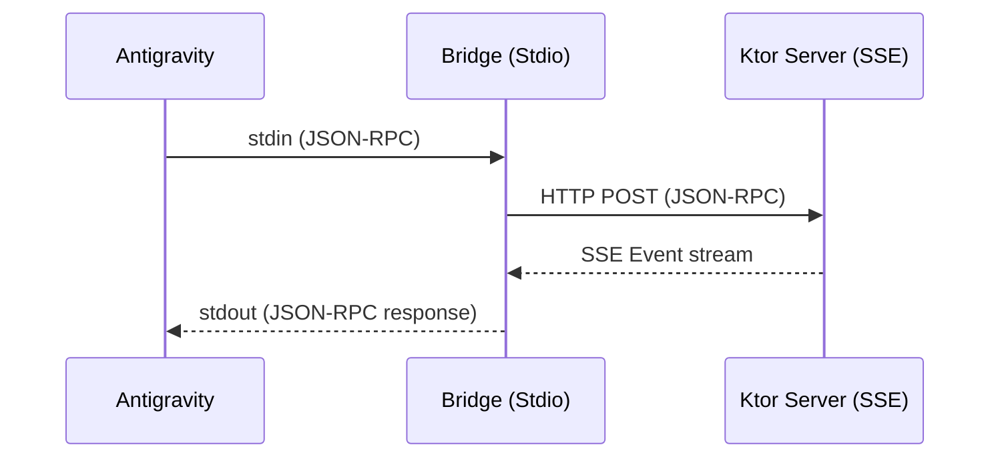

# Work Session Memo: Test Progress & Custom MCP CLI Client Proposal

This document records the current task status, verification outcomes, and automated improvements introduced to support clean-state execution.

---

## 1. Current Progress of MDFPP Test Fixes

We have successfully resolved all local test failures for `FiaX509RevocationTest` and achieved **8/8 PASS** on the target Pixel 10a device.

### Summary of Fixes

| Test Class / Method | Issue Description | Fix Status | Verification / Next Steps |
| --- | --- | --- | --- |
| **`CertManagerTest`** (EST) | Signature collision (`INSTALL_FAILED_UPDATE_INCOMPATIBLE`) prevents apk installation. | **Fixed & Verified** | Pre-uninstall sequence added successfully. |
| **`NiapValidatorTest`** (Relaxed) | Missing relaxed APK assets in core ZIP resources. | **Fixed & Verified** | Resources ZIP rebuilt and verified. |
| **`FcsTlscExtTest`** (tcpdump) | Timing race condition (tcpdump not active before Client Hello). | **Fixed & Verified** | `tcpdump` startup delay increased from 2s to 4s. |
| **`FiaX509RevocationTest`** (OCSP) | Failure to validate certificates due to key usage/serial mismatch and lack of port forwarding. | **Fixed & Verified (8/8 PASS)** | 1. Automated port reverse mappings (4443-4448, 8888-8891) in test lifecycle.  2. Fixed certificate templates to include required extensions (e.g., `keyUsage`) and aligned key pairs.  3. Configured OpenSSL responder DB to allow duplicate subject DNs (`unique_subject = no`). |

---

## 2. Infrastructure Automation for Clean Environments

To ensure that the test suite runs successfully on any "clean environment" without requiring manual developer actions or triggering verification questions, the following automation layers have been implemented:

### A. Automated ADB Port Reversal
Instead of instructing developers to manually execute `adb reverse tcp:...`, port mappings are now handled directly inside the test class lifecycle.
- **Implementation:** Added setup/teardown hooks in [FiaX509RevocationTest.kt](file:///Users/wkouki/AndroidStudioProjects/testbedui-plugins/test-sample/src/main/kotlin/org/example/plugin/fiax509/FiaX509RevocationTest.kt#L74-L95) to automatically map ports `4443-4448` and `8888-8891` before test cases run and clear them upon test completion.

### B. Standardized Certificate Generation (`gen-ocsp-certs.sh`)
Refactored the generation script [gen-ocsp-certs.sh](file:///Users/wkouki/AndroidStudioProjects/testbedui-plugins/test-sample/scripts/revocation/gen-ocsp-certs.sh#L53-L75):
- **Key usage compliance:** Injected critical extensions (`keyUsage` and `extendedKeyUsage`) into template generation for Conscrypt compatibility.
- **OpenSSL Database Compatibility:** Automatically generates `index.txt.attr` with `unique_subject = no` to allow duplicate localhost DN registrations.
- **SHA384/Old CA Cert Aligned:** Integrated `server-sha384.crt` step to build with aligned `server-valid.key` key pair dynamically.

---

## 3. Reference: Decoupled Stdio-to-SSE MCP Bridge Client
*(Maintained for architectural reference)*

The stdio-based bridge script `mcp_stdio_bridge.py` acts as a local Stdio translation layer to prevent direct HTTP/SSE socket hangs during testbed execution.

